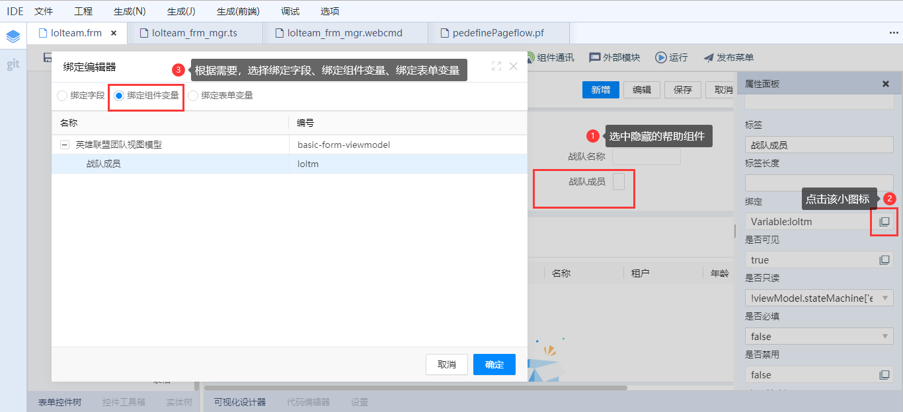
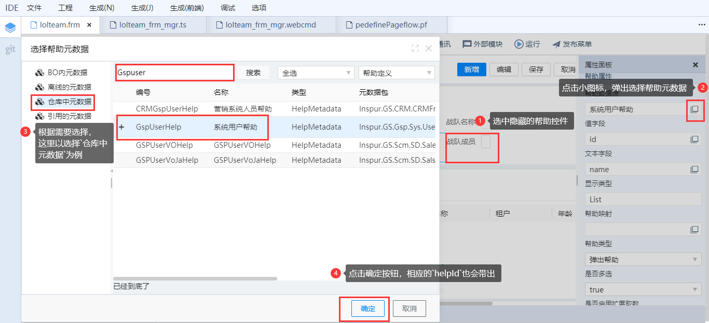

# 如何添加隐藏帮助

## OverView
在多选帮助批量新增主表、子表等场景时需要在表单中添加一个隐藏帮助，该文档介绍如何添加隐藏帮助。

## 如何配置

下面以`多数据源列卡界面模板`为例介绍如何添加隐藏帮助。

选中`detail-form-section`节点并切换到`代码编辑器`视图，在`contents`中增加以下代码：

```json
{
  "id": "HiddenContainer-form",
  "type": "HiddenContainer",
  "appearance": {
    "class": "d-flex flex-wrap  flex-fill"
  },
  "border": null,
  "font": null,
  "margin": null,
  "padding": null,
  "size": null,
  "contents": [
    {
      "id": "helpId",
      "type": "LookupEdit",
      "title": "name",
      "appearance": {
        "class": "col-12"
      },
      "border": null,
      "font": null,
      "margin": null,
      "padding": null,
      "size": null,
      "binding": {
	"type": "Variable",
        "path": "users",
        "field": "b734aefa-e12c-4638-9b0a-5d3196dc59ed"
      },
      "readonly": "!viewModel.stateMachine['editable']",
      "require": false,
      "disable": false,
      "placeHolder": "",
      "format": null,
      "validation": null,
      "value": null,
      "dataSource": {
        "uri": "detail-form-component-viewmodel.users",
        "displayName": "用户帮助",
        "idField": "id",
        "type": "ViewObject"
      },
      "textField": "name",
      "valueField": "id",
      "displayType": "List",
      "multiSelect": true,
      "pageSize": null,
      "pageIndex": null,
      "pagination": null,
      "dialogTitle": null,
      "showMaxButton": null,
      "showCloseButton": null,
      "resizable": null,
      "buttonAlign": null,
      "mapFields": "",
      "lookupPicking": "",
      "lookupPicked": "",
      "linkedLabelEnabled": false,
      "linkedLabelClick": null,
      "visible": true,
      "enableExtendLoadMethod": true,
      "editable": false,
      "clear": null,
      "helpId": "4c776eae-0b99-46a5-91c0-07782daaa0ef",
      "expandLevel": -1,
      "isRecordSize": false,
      "lookupStyle": "popup",
      "enableFullTree": false,
      "loadTreeDataType": "default",
      "isTextArea": null,
      "holdPlace": false,
      "beforeShow": null,
      "beforeHide": null,
      "onShown": null,
      "onHidden": null
    }
  ],
  "controlsInline": false,
  "visible": true
}
```

以下字段请根据实际情况进行配置：

`contents` -> `id`:帮助控件Id，弹出帮助时会用到该Id

`multiSelect`：启用帮助多选

`helpId`：帮助元数据Id，当改变`帮助数据源`时（在`可视化设计器`模式下修改），`helpId`会自动带出。

`binding`：绑定，必须修改，结合自己业务场景，绑定字段或者绑定变量都可以。`可视化设计器`操作步骤见下图：



`dataSource`：数据源，必须修改，选择自己所需要的的帮助元数据（在`可视化设计器`模式下修改，会带出`helpId`）。`可视化设计器`操作步骤见下图：


