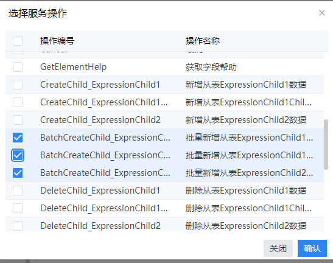
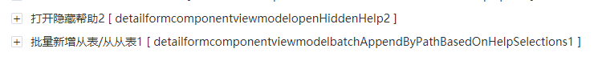

# 通过多选帮助批量新增子表数据

## 配置方法

### 1、添加EAPI

打开对应表单的EAPI文件，点新增按钮，勾选`批量新增从表{表名}`操作

### 2、修改dom，增加隐藏帮助

参考文档：[如何添加隐藏帮助](faq/how-to-add-hide-help)

### 3、添加`打开隐藏帮助`及`批量新增从表/从从表(batchAppendByPathBasedOnHelpSelections)`命令

添加`打开隐藏帮助`及`批量新增从表/从从表(batchAppendByPathBasedOnHelpSelections)`命令，该命令位于`批量编辑控制器`中。

> 命令参数含义：
>
> grid所在frame：要批量新增数据的grid所在frame的frameId
>
> 帮助字段映射：帮助字段与grid中字段如何映射，json结构

`打开隐藏帮助`命令挂载到按钮上，点击时即可弹出帮助。

`批量新增从表/从从表`挂载到隐藏帮助的帮助后事件上。

### 4、清空帮助选择[可选]

如果希望打开帮助时上次勾选的内容清空，则可以在帮助前事件上挂载`清空帮助勾选`