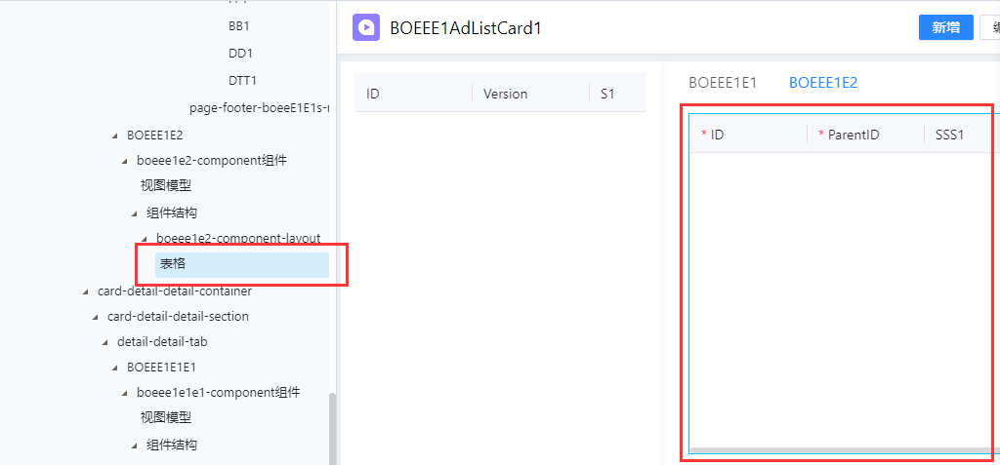
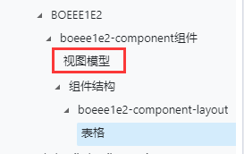
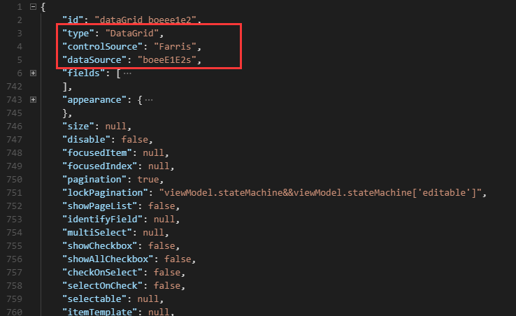

# 如何将子表表格切换为子表树

由于子表树功能暂未在设计器上开放，目前只能通过修改表单DOM的方式实现子表树。

## 一、添加字段及自定义动作

1、添加“分级码分级信息”或“父节点分级信息”业务字段到对应子表

2、根据业务需要添加“子对象分级码分级方式新增子级”、“子对象分级码分级方式新增同级”或“子对象父节点分级方式新增子级”、“子对象父节点分级方式新增同级”自定义动作。

3、同步字段、自定义动作到VO

4、注册自定义动作到EAPI

## 二、修改表单DOM

1、设计器中找到要切换为树控件的`表格控件`



2、找到该控件对应的视图模型



3、删除视图模型中所有字段并保存

4、替换DOM

选中要切换为树控件的`表格控件`，切换到`代码编辑器`模式，看到的结构如图：



> 复制`dataSource`对应的值，后续会用到。

用下面的DOM结构替换代码编辑器中的代码。

```json
{
  "id": "treeGrid",
  "type": "TreeGrid",
  "controlSource": "Primeng",
  "appearance": {
    "class": "f-primeng-treetable f-utils-fill-flex-column"
  },
  "size": null,
  "dataSource": "数据源",
  "fields": [],
  "fixedHeader": true,
  "fit": true,
  "focusedItem": null,
  "focusedIndex": null,
  "idField": "id",
  "udtField": "分级码字段",
  "fieldEditable": true,
  "editable": "viewModel.stateMachine['editable']",
  "multiSelect": false,
  "selectable": null,
  "itemTemplate": null,
  "toolBar": null,
  "summary": null,
  "expendAll": null,
  "expandLevel": null,
  "parentField": null,
  "onSelectionChange": "",
  "disable": false,
  "expandNode": null,
  "nowrap": true,
  "virtualized": false,
  "showBorder": false,
  "showHeader": true,
  "showCheckbox": false,
  "showAllCheckbox": false,
  "checkOnSelect": true,
  "selectOnCheck": true,
  "cascadeCheck": true,
  "cascadeDown": true,
  "cascadeUp": true,
  "keepSelect": true,
  "onlySelectSelf": true,
  "striped": true,
  "showIcon": false,
  "useIconFromData": false,
  "leafIcon": null,
  "expandIcon": null,
  "collapseIcon": null,
  "bindMainEntity": false,
  "visible": true,
  "styler": null,
  "resizableColumns": true
}
```

> 将表格中`dataSource`的值替换到上面DOM中对应字段。
>
> 填写分级码字段到`udtField`属性中。

5、选中表格对应的视图模型，添加需要展示的字段

## 三、挂载子表树相关的命令

1、添加`卡片控制器`命令构件

2、添加命令

从`卡片控制器`中选择`新增子节点（子表树）`、`新增兄弟节点（子表树）`命令，并将命令挂载到子表树对应按钮。

