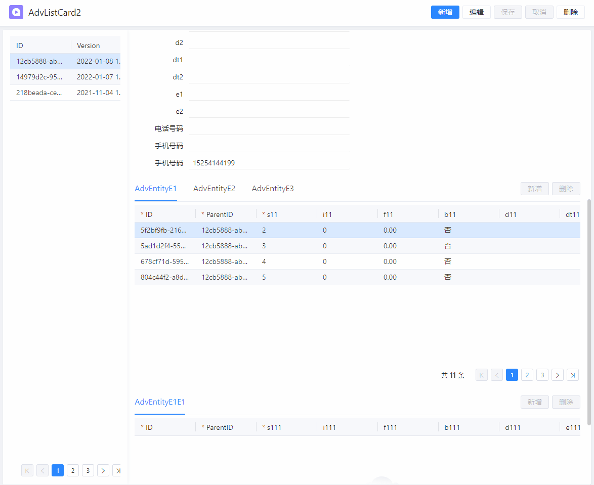
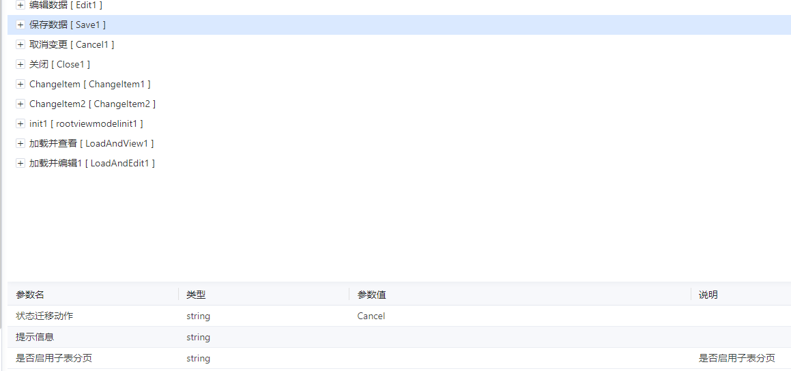
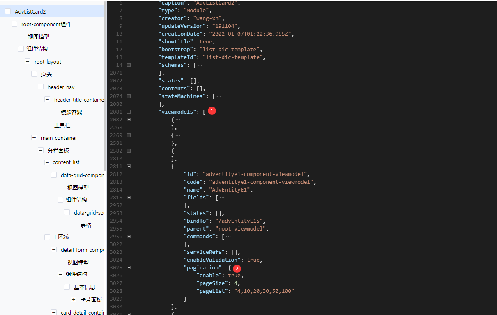

# 子表分页

## 概述

在表单使用中会遇到因子表数据量大导致切换行卡顿、点击保存或取消按钮等待时间长的问题。为了解决该问题，控制器集成了子表分页功能，启用子表分页后子表数据不会全部加载，而是仅加载某一页的数据，减少渲染次数及内存占用，以优化表单性能，提升表单使用体验。

## 适用场景

目前仅支持从表分页，不支持从从表分页。

## 运行效果

## 开发步骤

### 1、升级WebCMP

升级webcmp至最新，升级后卡片的保存、取消、编辑等命令均新增了`是否启用子表分页`参数。

### 2、修改DOM

切换到`代码编辑器`视图，在对于的`viewModel`中启用分页。

### 3、配置命令

配置`是否启用子表分页`参数，根据表单模板需配置以下命令：

> **卡片模板:**
>
> 加载并查看、加载并编辑、编辑数据、保存数据、删除子表数据、切换上一条或下一条。

> **高级列卡模板：**
>
> 加载卡片数据、编辑数据、保存数据、取消、删除子表数据、移除主表数据。

### 4、生成编译表单

生成编译表单并部署。

### 5、开发完成

