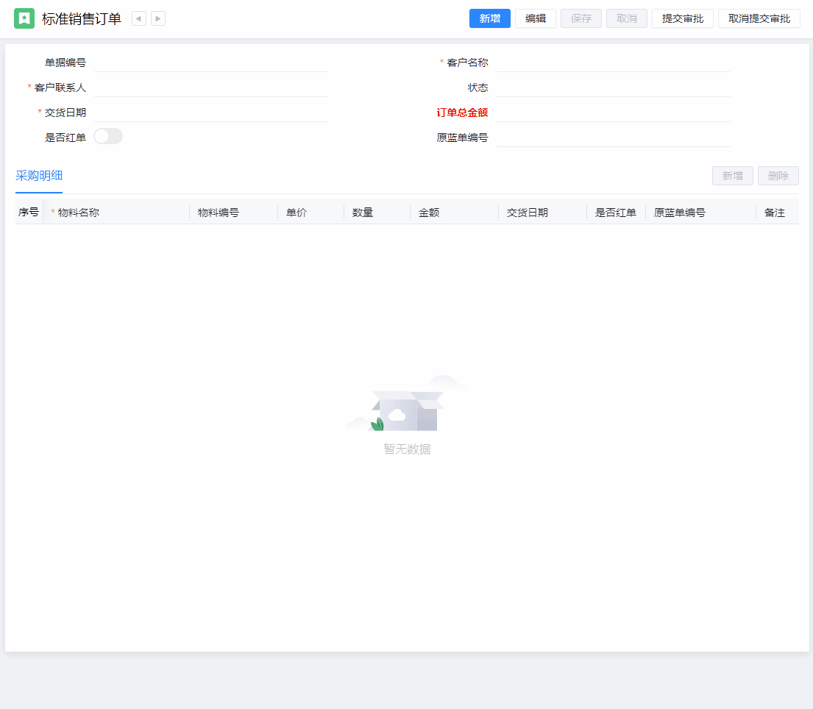
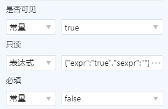
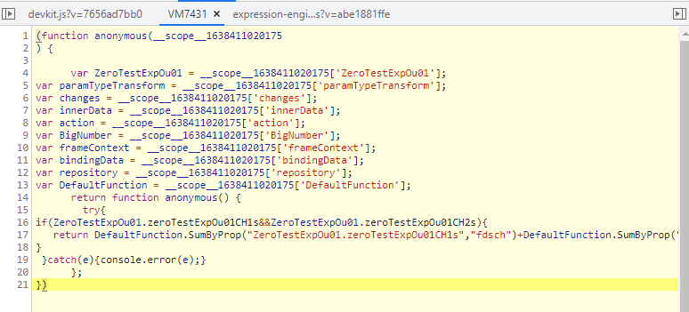

# 表达式使用文档

## 概述

表达式支持计算表达式、只读表达式、依赖表达式、相关表达式、帮助前表达式、校验表达式、必填表达式；

### 计算表达式

字段的值通过其他字段或VO变量经过一系列计算得到。如：

```javascript
// 订单总金额 = 订单表金额合计
DefaultFunction.SumByProp(\"SO.soItems\",\"fee\")
```

### 只读表达式

使用实体字段值或VO变量动态控制卡片或表格字段的只读状态，当表达式返回`真`时字段只读。如：

```javascript
// 订单编号不包含GS时控件只读
!DefaultFunction.Contains(SO.billCode,"GS")
```

### 依赖表达式

即清空表达式，即当表达式返回`真`时，清空当前字段的值。

### 相关表达式

即显隐表达式，即当表达式返回`真`时，控件可见，否则隐藏控件或表格列。

### 帮助前表达式

帮助前表达式类似用户开发的帮助前，当表达式返回`真`时允许弹出帮助，否则弹出开发人员设置的提示信息并阻止帮助的弹出。

### 校验表达式

校验表达式类似前端校验，不过校验规则为表达式。当表达式返回`真`时校验通过（如果无返回值则认为`假`），否则校验失败并在控件下方展示开发人员配置的校验信息。

### 必填表达式

校验表达式的一种场景。当表达式计算结果为`真`时字段必填，否则非必填。

## 适用场景

在表单开发过程中会涉及到字段计算、控件显隐控制、控件只读、字段必填、字段校验等场景，这些场景开发难度不大但却占用大量的开发时间，且出现问题后需要逐个调试、修改。

如常见的销售订单中采购明细表中金额=单价*数量。在开发过程成经常会遇到因使用了错误的上下文导致计算结果错误的问题。其次，通过构件开发的逻辑会在编译阶段打包到表单中，后续二开扩展不方便。

使用表达式开发业务逻辑时不需要考虑当前行、执行时机等问题。开发人员仅需关心业务逻辑。上述采购行金额场景仅需编写`SO.soItems.price * SO.soItems.qty`即可实现金额计算。再比如销售订单中红单、蓝单编号场景可以使用如下表达式：

```javascript
// 原蓝单编号只读表达式
!!SO.isRed
// 原蓝单编号依赖表达式
!SO.isRed
```


## 运行效果



> 图中包含以下表达式：
>
> 校验表达式：其中卡片和表格中的交货日期设置了校验表达式，值不能小于当天。
>
> 计算表达式：卡片中订单总金额的值等于采购明细中单价*数量的和。
>
> 必填表达式：当是否红单值为真时，原蓝单编号必填。
>
> 依赖表达式：当是否红单值为假时，清空原蓝单编号。
>
> 只读表达式：当是否红单值为真时，原蓝单编号可编辑。当值为假时，原蓝单编号字段只读。

## 开发步骤

###  1.配置表达式

   不同类型的表达式配置位置不同，只读、必填、相关表达式集成到了控件属性面板中的是否只读、是否必填、是否可见属性面板中。

   > 


   计算、依赖、校验在属性面板下方`表达式`分组中。

   > 

   找到表达式配置入口后下一步开始编写表达式。

   #### 1.1 表达式编写

   表达式引擎基于匿名函数实现，用户编写的表达式最终会放到一个匿名函数中执行。通过匿名函数包装可以简化用户表达式编写过程。

   ##### 1.1.1 如何编写表达式

   表达式设计器内编写的代码最终会包装到一个函数内部，所以编写表达式就和编写方法一致，可以声明变量、定义函数、添加`判断语句`、`循环语句`。表达式除了标准的Javascript上下文外还支持内置函数、大数计算以简化开发过程。

   编写表达式时除需要基本的Javascript上下文、内置方法、大数等还需要参与计算的数据。表达式的数据来源有实体数据和VO变量。其中实体的表示方法为`实体编号.属性编号`。实体数据可以理解为一个大对象，变量名称就是实体编号，类似下面代码：
   ```javascript
   var SO = {
    billCode:"john",
    totalFee:20,
    createAt:"2012-12-23"
   };
   ```

   因此，表达式在编写时并不强依赖实体，仅识别数据结构。

   如果实体字段`交货日期createAt`的值等于日期类型的字段`createAt`的值加5天，且实体编号为`SO`，则表达式可以编写为：

   ```javascript
   // 推荐优先使用内置函数
   DefaultFunction.DateTimeAddDays(SO.createAt,5)
   // DateTimeAddDays返回的是日期对象，如果需要转换为字符串，则可以调用FormatDefineDate方法
   // DefaultFunction.FormatDefineDate("yyyy-MM-dd",DefaultFunction.DateTimeAddDays(SO.createAt,5))
   ```

   是不是和编写普通JavaScript脚本一样？我们再看下判断、循环等场景。

   ```javascript
   if(SO.totalFee>=10){
      return a;
   }else{
      return b;
   }
   ```

   当内置函数无法满足需求时，可以编写Javascript代码。语法和普通的Javascript一致，但表达式计算完成后应将结果返回。

   ##### 1.1.2 返回值

   表达式中只有一条语句，且表达式在第一行，则可以只写表达式，无需显式`return`（支持显式）：

   ```javascript
   DefaultFunction.Sum([1,2,3])
   // 或者
   return DefaultFunction.Sum([1,2,3]);
   ```

   如果在表达式中使用了类似**判断、分支、函数**等`带返回的语句`或**以空行开始**或**有多行代码**，同时希望整个表达式有返回值，则应显式`return`，否则表达式计算结果为`undefined`。

   当计算结果为`undefined`时，不会有任何作用。鉴于此，如果需要返回类似`空字符串`、`null`时，应显式`return`。

   ```javascript
   var bxCode = DefaultFunction.Add("bx_",SO.billCode);
   return bxCode;// 换行后必须显式return
   ```

   ##### 1.1.3 返回常量

   ```javascript
   SO.int1 + SO.int2 // 或者 return SO.int1 + SO.int2
   // 2*4+6 // 或者 return 2*4+6
   ```

   ##### 1.1.4 判断

   ```javascript
   var x = 1;
   var y = 2;
   if(x>y){
   	return true;
   }
   ```

   ##### 1.1.5 自定义方法

   ```javascript
   function plus(x,y){
   	return x+y;
   }
   return plus(1,2);
   ```
   ##### 1.1.6 获取UIState
   ```javascript
   DefaultFunction.GetContextParameter("userId")
   ```
###  2.编译表单

   表达式配置完成后生成并编译前端表单即可查看效果。

## 常见问题

### 依赖解析

表达式引擎加载表达式时会解析每个表达式的依赖，如果依赖解析出现问题会导致表达式运行时机不对。因此如果发现表达式引擎解析器解析依赖错误时可以通过手动修复的方式指定依赖。
	
表达式依赖目前支持实体属性、UIState。依赖最终为字符串数组，每一个元素代表一个依赖。实体属性依赖以`ENTITY~`开头，状态依赖以`STATE~`开头。基于此，如果某个表达式依赖了实体的price和UIState的total属性，则依赖数组为:

```typescript
[
	"ENTITY~/price",
	"STATE~/total"
]
```

如果表达式依赖解析错误，则可以在编写表达式的时候在表达式中指定依赖，以上依赖编写为：
```javascript
/*__define__({deps:["ENTITY~/price","STATE~/total"]})*/
```

将以上注释放到表达式中即可。

### 调试

在表达式开发过程中会遇到表达式执行结果与预期不一致的情况，此时需要对编写的表达式进行调试。可以在表达式最前面添加`debugger`关键字，如：

```javascript
debugger;return SO.int1 + SO.int2;
```

> 添加`debugger`后，后面的语句必须加`return`;



debugger只在开发过程中使用，建议直接修改部署目录下的表达式描述文件，以节约开发时间。

### 浮点运算

Javascript浮点运算存在精度问题，如：

```javascript
0.1+0.2 = 0.30000000000000004
2.55 * 3 = 7.6499999999999995
```

鉴于此在涉及浮点运算时应使用BigNumber进行运算。当字段类型为大数时直接返回字符串即可。

```javascript
new BigNumber(0.1).plus(0.2).toNumber() // 非大数字段
new BigNumber('99999999999').plus('99999999999999999').toFixed() // 大数字段
```

### 字段取值

获取主表或子表简单字段时直接使用`实体.字段名`或`实体.子表s.字段名`即可，但涉及到udt或关联字段时直接使用点操作符可能会产生空引用错误，此时需要在使用时对字段进行判断。

```javascript
Entity.child1s.price // 可能值为price、undefined
Entity.child1s.udt.udt_prop1 // 当子表没有数据时会报错
// 建议使用如下方式获取字段值
var prop1 = Entity.child1s && Entity.child1s.udt && Entity.child1s.udt.udt_prop1 || 0;
// 如果prop1为数字类型，则默认值为0，如果为字符串则应返回空字符串,其余类型类似。如：
var prop2 = Entity.child1s && Entity.child1s.udt && Entity.child1s.udt.udt_prop2 || '';
```

### 字段路径

使用表达式设计器双击选择子表字段时默认的格式为`Entity.child1s[0].prop1`，表达式场景目前没有第一行的概念，因此建议删除`[0]`，虽然表达式引擎在表达式初始化时对`[0]`及`*`做了处理，但后续可能会涉及到该场景，所以在选择字段时请务必删除字段路径中的`[d]`及`*`。

```javascript
if(Entity.child1s[0].name){ // 修改为if(Entity.child1s.name)
    return true;
}else{
    return false;
}
```

### 字段结构、字段值

表达式中的字段分两种场景使用：结构、值；结构是指计算时不使用该字段路径的值，仅使用结构，所以两端应该有双引号或单引号。而作为值使用时不能添加双引号，否则会当作字符串进行计算。

```javascript
DefaultFunction.SumByProp("Entity.child1s","int1") // SumByProp参数使用的是字段的结构
DefaultFunction.Sum(Entity.child1s.int1,Entity.child1s.int2); // 使用字段值
```

### 循环依赖

设计表达式时应避免出现循环依赖。

```javascript
字段A的值 = 字段A的值 + 字段B的值; // 循环依赖
```
