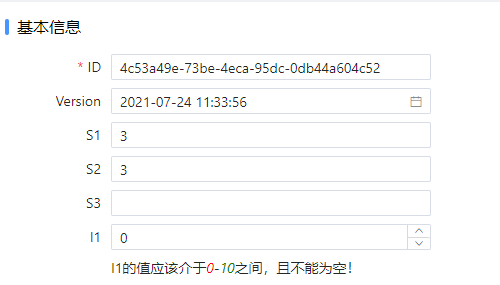
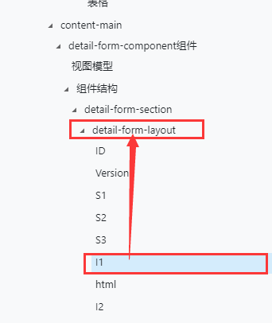
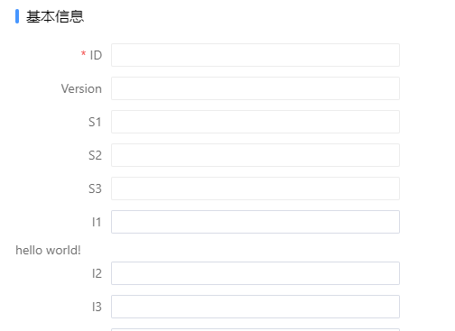
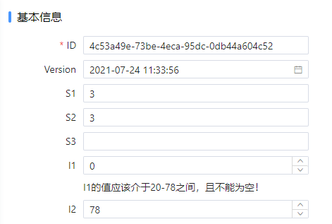

# Html模板

## 场景介绍

在开发过程中有时需要在界面上展示自定义组件或简单的html标签，此时可以使用`HtmlTemplate`实现。`HtmlTemplate`和普通组件一样，可以直接使用实体、变量，访问表单上下文。

## 实现过程

下面以高级列卡为例，介绍如何使用`HtmlTemplate`。

如下图所示，我们希望在字段`I1`下面增加`I1的值应该介于x-y之间，且不能为空！`。最终效果如下：



1. 找到控件父容器

   在`表单控件树`中找到对应字段`I1`，选中`I1`父级`detail-form-layout`并切换至`代码编辑器`视图。

   

2. 添加`HtmlTemplate`

   在Dom中找到`I1`对应的代码。在`I1`和`I2`中间位置插入以下代码。

   ```json
   {
      "id":"html",
      "type":"HtmlTemplate",
      "html":"<span>hello world!</span>"
   }
   ```

   > 选中`hello world!`后可以在右侧属性栏面板中看到`html`属性，点击弹出按钮可以在`代码编辑器`中输入html代码

   切换至`可视化设计器`，现在我们可以看到`hello world!`已经显示在设计器上了。但没有和控件对齐，我们希望它显示在输入控件的下方。

   

3. 调整样式

   ```html
   <div class="col-12" *ngIf="true">
   	<div class="farris-group-wrap">
   		<div class="form-group farris-form-group">
   			<label class="col-form-label"></label>
   			<div class="farris-input-wrap">
   				<span>I1的值应该介于10-30之间，且不能为空！</span>
   			</div>
   		</div>
   	</div>
   </div>
   ```

   > 该html结构和卡片区域其他输入控件一致，从而实现和普通控件一致的展示效果。
   >
   > 在开发中不需要记住这段代码，只需要打开代码生成目录，找到对应的表单，复制其他组件的代码并删除不需要的代码即可。

4. 使用表单数据

   到目前为止我们已经在I1控件的下方加了提示文本，但内容是静态的。下面我们一起看下如何使用表单上的数据。

   假设我们发起了一个HTTP请求从后端获取I1的最小值，并将数据保存到了`组件变量`**min**中，同时我们希望提示信息中最大值使用实体中`I2`的值。

   所以HtmlTemplate中代码可以这样编写：

   ```html
   <div class="col-12" *ngIf="true">
   	<div class="farris-group-wrap">
   		<div class="form-group farris-form-group">
   			<label class="col-form-label"></label>
   			<div class="farris-input-wrap">
   				<span>I1的值应该介于{{viewModel.uiState['min'] || 0}}-{{viewModel.bindingData['i2'] || 10}}之间，且不能为空！</span>
   			</div>
   		</div>
   	</div>
   </div>
   ```

   > 由于组件变量和实体值可能为空或0，所以上述代码中设置了默认值。

   至此我们可以看到如下效果：

   

5. 设置颜色

   我们已经实现了基本的效果，但是希望最大值、最小值能用红色标记出来。继续修改代码：

   ```html
   <div class="col-12" *ngIf="true">
   	<div class="farris-group-wrap">
   		<div class="form-group farris-form-group">
   			<label class="col-form-label"></label>
   			<div class="farris-input-wrap">
   				<span>I1的值应该介于<i style="color:red">{{viewModel.uiState['min'] || 0}}</i>-<i style="color:green">{{viewModel.bindingData['i2'] || 10}}</i>之间，且不能为空！</span>
   			</div>
   		</div>
   	</div>
   </div>
   ```

   