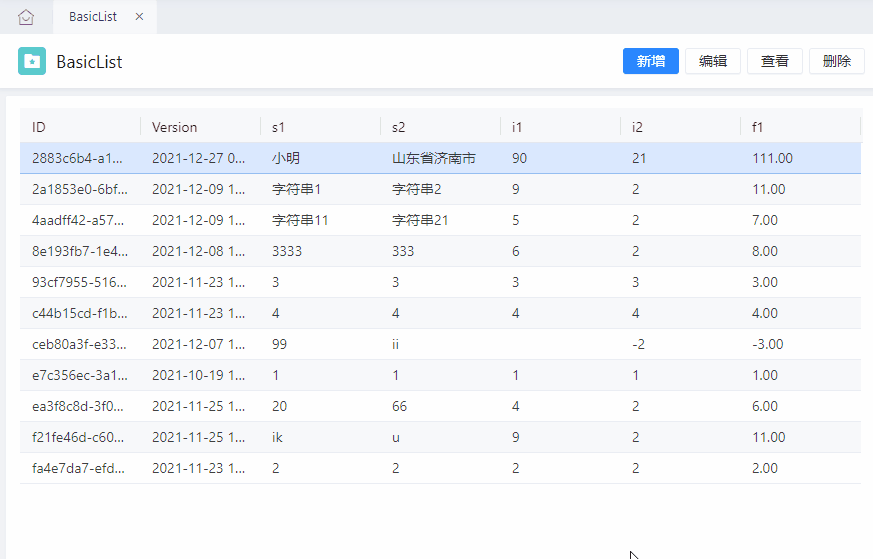
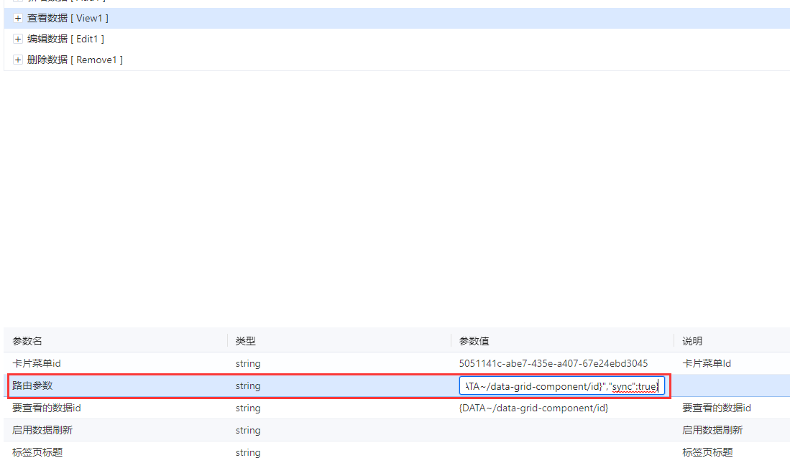
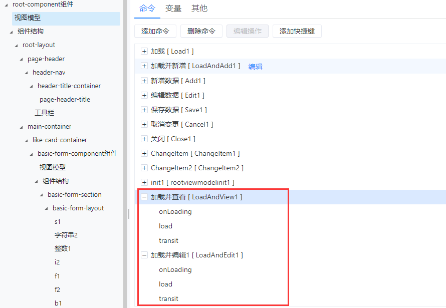
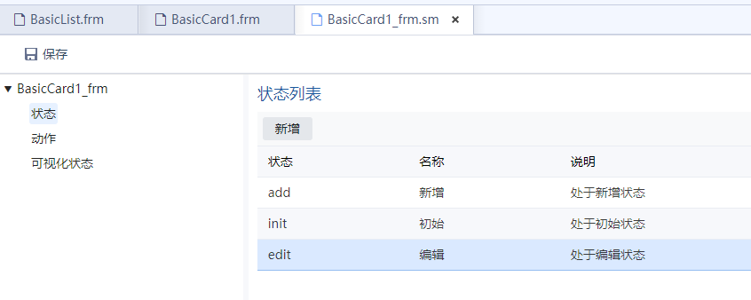

# 支持菜单切换时表单数据及状态同步

## 场景介绍

目前iGIX菜单或应用切换时存在被打开的标签数据及状态和用户操作不统一的问题。主要表现在查看和编辑数据场景，如在查看或编辑卡片数据时执行了编辑、保存、新增操作。导致查看或编辑的数据并非用户在内置列表界面选择的数据、卡片状态机和用户点击的按钮无法对应等问题。

表单数据及状态与操作不统一导致用户在使用时感到困惑。因此开发者希望在切换菜单时能够同步数据及表单状态。基于目前的场景分析，提出了一种同步策略：

当卡片展示的数据不是用户点击的数据时，提示用户「确定要加载数据并放弃当前修改？」

当卡片状态机状态不是用户指定的状态时，提示「确定切换到某状态？」

当卡片展示的数据及状态机状态均发生变化时，提示「确定要加载数据并切换到某状态？」

## 运行效果

## 开发步骤

### 前置条件

升级WebCMP至最新

### 开启特性

打开列表界面，选中视图模型中的`查看数据`、`编辑数据`命令。在命令的路由参数中增加"sync":true

### 生成编译卡片表单

打开卡片表单，确认卡片视图模型中的`加载并查看`、`加载并编辑`命令中存在`onLoading`操作。

确认后重新生成编译表单。

### 修改状态描述

提示信息中「确定切换到某状态？」中的状态就是状态机中的状态。如点击列表中的编辑按钮，此时Action为LoadAndEdit1，卡片中执行的状态机切换动作为Edit，该动作会将页面切换为edit状态，其对应的名称为`编辑`。所以提示信息就是「确定切换到编辑状态？」，因此当状态描述不满足要求时可以通过修改页面状态的名称来实现。状态名称支持多语，写法为`{{多语key}}`

## 开发完成