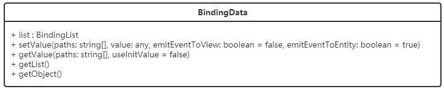
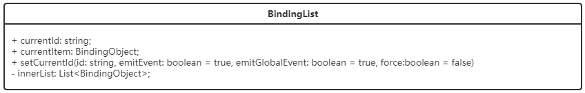
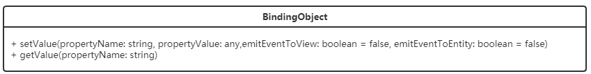

# BindingData

BindingData用于直接和界面绑定，它持有一个不可变的数据集合（BindingList），数据集合中是一个个不可变的数据对象（BindingObject）。

BindingData结构如下：







从上述类图中可以看到BindingData持有一个list，类型是BindingList，BindingList内部通过innerList存放BindingObject。

## 更新界面数据

### 接口定义

```javascript
/**
  * 根据paths设置属性值
  * @param paths 属性路径数组
  * @param value 属性值
  * @param emitEventToView 如果设置为true，则发送事件通知订阅它的组件、指令去更新界面，默认为false。
  * @param emitEventToEntity 如果设置为true，则同步去更新Entity上对应的字段，默认为true。
  */
public setValue(paths: string[], value: any, emitEventToView: boolean = false, emitEventToEntity: boolean = true)
```

### 示例

- 更新主表数据

  ```javascript
  bindingData.setValue(['name'],'ESG');
  ```

- 更新子表数据

  ```javascript
  bindingData.setValue(['soItems','price'],20);
  ```

- 更新业务字段数据

  ```javascript
  bindingData.setValue(['udt','udt_field'],'value');
  ```

- 仅更新界面数据（不提交变更集）

  ```javascript
  bindingData.setValue(['name'],'ESG',true,false);
  ```

  > 注意：
  >
  > 仅更新界面数据时bindingData必须是对应组件上下文的bindingData。
  >
  > 更新数据的命令挂载到不同的组件，产生的效果也不相同。如果命令挂到了卡片视图模型，那么可以直接在构件中注入`FrameContext`或`BindingData`并更新数据就可以。但如果命令挂到了非卡片视图模型，则应该先获取到卡片上下文的bindingData。
  >
  > - 命令挂在卡片视图模型:
  >
  >   ```javascript
  >   const frameContext = this.frameContext.bindingData;
  >   frameContext.bindingData.setValue(['name'],'ESG');
  >   ```
  >
  > - 命令挂在非卡片视图模型：
  >
  >   ```javascript
  >   const cardFrameContext = this.frameContext.appContext.frameContextManager.getFrameContextById('card-frameId');
  >   cardFrameContext.bindingData.setValue(['name'],'ESG');
  >   ```
  >
  >   

  

## 获取界面数据

### 接口定义

```javascript
/**
  * 获取paths对应的属性值
  * @param  paths 属性路径数组
  * @returns 属性值
  */
public getValue(paths: string[], useInitValue = false)
```

### 示例

- 获取主表数据

  ```javascript
  bindingData.getValue(['name']) //'ESG'
  ```

- 获取从表中字段属性

  ```javascript
  bindingData.getValue(['soItems','price']); // 20
  ```

- 获取业务字段数据

  ```javascript
  bindingData.getValue(['udt','udt_field']); // 'value'
  ```

  

## 获取指定BindingObject

### 接口定义

```javascript
/**
  * 通过主键获取对应的bindingObject
  */
bindingData.list.findById(id: string): BindingObject;
```

### 示例

- 获取某个主实体

  ```javascript
  bindingData.list.findById("id");
  ```

- 获取某个实体下子表的所有数据

  ```javascript
  // 获取主实体
  const bindingObject = bindingData.list.findById("id") as BindingObject;
  // 获取该实体下的某个子表数据
  const bindingList = bindingObject.getValue("soItems") as BindingList;
  ```

- 获取子表某一行数据

  ```javascript
  // 获取主实体
  const bindingObject = bindingData.list.findById("id") as BindingObject;
  // 获取该实体下的某个子表数据
  const bindingList = bindingObject.getValue("soItems") as BindingList;
  // 子表行数据
  const childrenBindingObject = bindingList.findById('子表数据id');
  const name = childrenBindingObject.getValue("name"); // 或者childrenBindingObject['name']
  ```

## 常见问题

### 赋值或取值时为何不用指定主键？

   示例中取值或赋值时并没有指定主键值，这是由于BindingData赋值或取值时都是对当前行就行操作的，所以不需要指定主键。所以在计算&行切换场景下会导致取值或赋值错误，如本来想给第一行的某个字段赋值，结果由于行切换导致把值赋给了其他行。

   如果遇到赋值错误的情况可以通过BindingObject赋值或取值。

### 通过bindingData赋值了，界面也刷新了，但保存不上:tired_face:

   这种情况多发生在有后端请求的情况下，比如通过bindingData赋值后紧接着有一个后端请求。由于bindingData赋值是异步的（目前是），这就可能导致赋值还没有结束（还没有产生变更）请求就发送了，从而请求中没有对应的变更，请求回来后会默认清空本地变更，从而导致界面上显示数据已经修改，但数据库中数据并未修改。

   解决该类问题可以通过实体赋值的方式，给实体赋值是同步的，赋值完成后变更就会产生，这样再发送请求时就可以把变更带到后端。

