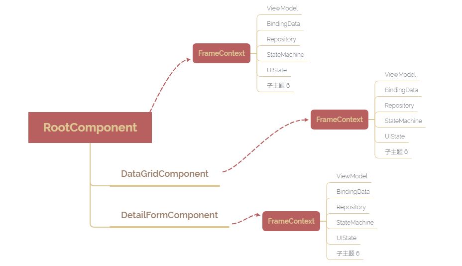

# 上下文

## Overview

每个组件（FrameComponent）都有自己的上下文（FrameContext）,通过上下文可以获取控制器的所有属性，如常用的`frameId`、`BindingData`、`Repository`、`ViewModel`、`StateMachine`、`UIState`等。上下文在内存中呈树形结构，依附于FrameComponent。结构如下：



所以在编写`Web构件`时通常先引入FrameContext，如：

```javascript
import {FrameContext,BindingData,Repository} from '@farris/devkit';

constructor(private frameContext:FrameContext){}

public method(){
    const bindingData: BindingData = this.frameContext.bindingData;
    const repository: Repository = this.frameContext.repository;
}
```

> `FrameContext`称为`ViewModelContext`更合适，可以理解为`MVVM`架构中`VM`的上下文。

控制器中亦存在`ViewModel`的概念。和`MVVM`架构中的的VM一致，所以也可以从`VM`访问常用的属性。如：

```typescript
import {BindingData,Repository,ViewModel} from '@farris/devkit';

constructor(private viewModel:ViewModel){}

public method(){
    const bindingData: BindingData = this.viewModel.bindingData;
    const repository: Repository = this.viewModel.repository;
}
```


## 常用操作

### 获取当前上下文所属的组件

```typescript
this.frameContext.frameComponent;
```

### 获取当前上下文的根上下文

```typescript
this.frameContext.root;
```

### 获取当前上下文的appContext

```typescript
this.frameContext.appContext;
```

### 获取指定frameId的上下文

```typescript
this.frameContext.appContext.frameContextManager.getFrameContextById('data-grid-component');
```

### 获取表单所有上下文

```typescript
this.frameContext.appContext.frameContextManager.getFrameContexts();
```


## 常用属性

### BindingData 

[参考](/guide/binding-data)

### Repository

[参考](/guide/repository)

### ViewModel

控制器中ViewMode同MVVM架构中的VM，和FrameContext类似，可以通过ViewModel拿到FrameContext，同样的也可以通过FrameContext拿到ViewModel。

### namespace

命名空间，主要在组合表单场景用到，每一个表单都有自己的命名空间，被组合进来的表单其命名空间是相同的，如A表单组合了B表单，则B表单具有相同的命名空间，命名空间主要用于表单隔离。

### root

获取整个表单的根上下文

### uiState

获取当前组件的变量

### frameId

上下文标识。