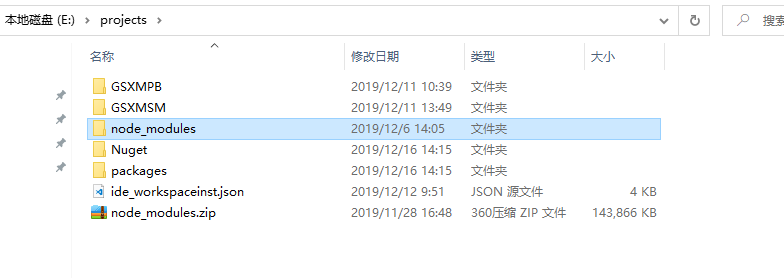

# 搭建开发环境

## 安装NodeJS

在开始工作之前，你必须设置好开发环境。

如果你的电脑里没有 Node.js®和 npm，请安装[它们](https://nodejs.org/en/download/)。

> 请先在终端/控制台窗口中运行命令 node -v 和 npm -v， 来验证一下你正在运行 node 10.x 和 npm 6.x 以上的版本。 更老的版本可能会出现错误，更新的版本则没问题。

安装完 Node 后建议设置 npm 镜像
>npm config set registry https://registry.npm.taobao.org --global  
>npm config set disturl https://npm.taobao.org/dist --global  

## 部署全局npm包

将“安装盘\离线部署npm包\1.部署全局npm包\npm.zip”解压缩至“{系统安装盘}:\Users{当前用户}\AppData\Roaming\”目录

## 部署开发环境依赖npm包

请将“安装盘\离线部署npm包\3.projects文件夹下放置npm包\node_modules”文件夹解压至运行环境所在根目录下的Projects 文件夹。

